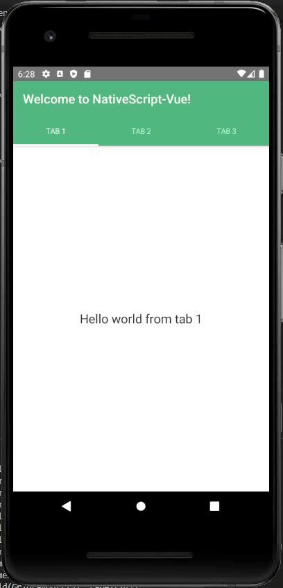

# NativeScript with Vue Quick Start (Hello World App)



### When starting with NativeScript and Vue from scratch, follow these steps for local development setup:

1. Make sure that [Node.JS](https://nodejs.org/en/) is installed on your machine globally. Open your command prompt terminal, and run `node -v` to confirm.

2. Execute `npm install -g nativescript` in your command prompt terminal. This will install NativeScript CLI on your machine globally. After installation is done, run `tns` to ensure NativeScript CLI was installed successfully.

3. For Windows 7 or later, open your command prompt terminal as an administrator (Windows key --> type "cmd" --> right click --> Run as Administrator), and run the following script:
```bash
@powershell -NoProfile -ExecutionPolicy Bypass -Command "iex ((new-object net.webclient).DownloadString('https://www.nativescript.org/setup/win'))"
```
> For macOS, run the following script instead in your terminal:
``` bash
ruby -e "$(curl -fsSL https://www.nativescript.org/setup/mac)"
```

4. After the script is finished, run `tns doctor` command to ensure that the installation was successful (you should see “No issues were detected” message).

5. Run `npm install -g @vue/cli @vue/cli-init` in your terminal. This will install the Vue CLI globally. (After it's done, you can run `vue -V` to confirm)

6. Open your favorite IDE (e.g. [VS code](https://code.visualstudio.com/download)), and inside a terminal, run `vue init nativescript-vue/vue-cli-template ns-vue-hello-world`
> Note: `ns-vue-hello-world` is the name of the project. Feel free to choose your own name.

> Note: You will be asked a few questions regarding your project's configuration. Here is an example with answers:
```bash
Project name? ns-vue-hello-world
Project description? A native application built with NativeScript-Vue
Application name? NativeScript-Vue Application
Unique application identifier? org.nativescript.application
Project version? 1.0.0
Author? Ahmed Alatawi <aalat001@gmail.com>
License? MIT
Select the programming language? javascript
Select a preset (more coming soon)? TabView
Install vuex? (state management) No
Install vue-devtools? No
Color scheme? forest
```

7. Run `cd ns-vue-hello-world && npm i`

8. For Windows, go ahead and install [Android Studio](https://developer.android.com/studio), open it, click on "AVD Manager" icon (on top right corner next to SDK manager icon), and create a new virtual device (emulator).
> Note: make sure that the virtual device is turned on after it's created.

> For macOS, install [Xcode](https://apps.apple.com/us/app/xcode/id497799835?mt=12) instead. Follow the steps [here](https://medium.com/@LondonAppBrewery/how-to-download-and-setup-xcode-10-for-ios-development-b63bed1865c) for more info on how to download and setup Xcode.

9. Go back to your IDE, and within the same terminal you had open (in step #7), run `ns run` command.

10. Finally, you should be able to see the project being prepared, packaged, and deployed to your virtual device. If you make any code changes, the changes should be reflected on the virtual device as well.

### Reference :dart:
* [NativeScript](https://nativescript.org/)
* [NativeScript-Vue](https://nativescript-vue.org/)


### Author :books:
[Ahmed Alatawi](https://github.com/AhmedAlatawi)